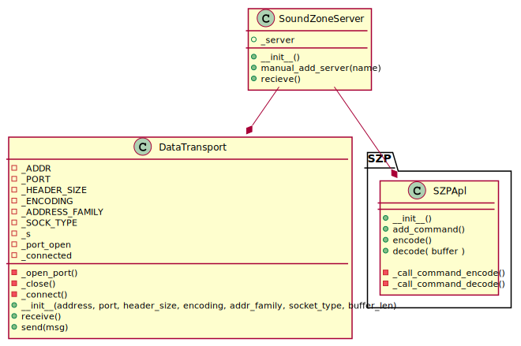

# SoundZoneProtocol Client
<!-- 
To compile puml use: (Assuming plantuml you are in the directory)
plantuml.jar -tsvg readme.md -o diagrams
-->

version = 0.0.1


---

<!--
```
@startuml class_diagram
package "SZP" {
    SoundZoneProtocol "1" --* "1" _CommandIDs
}
package client {
    SoundZoneClient "1" --* "1" SoundZoneProtocol
}
SoundZoneProtocol "1" --* "1" DataTransport


class SoundZoneClient {
    + __init__()
    + receive()
}

class SoundZoneProtocol {
    + ip

    - _get_ip_from_name(name)
    + __init__(name)
    + receive(sender)
    + send(receiver, obj_msg)
}

class _CommandIDs {
    + send
    + enroll_c
    + enroll_s
    + set_time_encode
    + set_size_payload
    + set_sound_compression
    + set_sample_rate
    + checkCon
}

class DataTransport {
    - _ADDR
    - _PORT
    - _HEADER_SIZE
    - _ENCODING
    - _ADDRESS_FAMILY
    - _SOCK_TYPE
    - _s
    - _port_open
    - _connected

    - _open_port()
    - _close()
    - _connect()
    + __init__(address, port, header_size, encoding, addr_family, socket_type, buffer_len)
    + receive()
    + send(msg)

}

@enduml
```
-->

