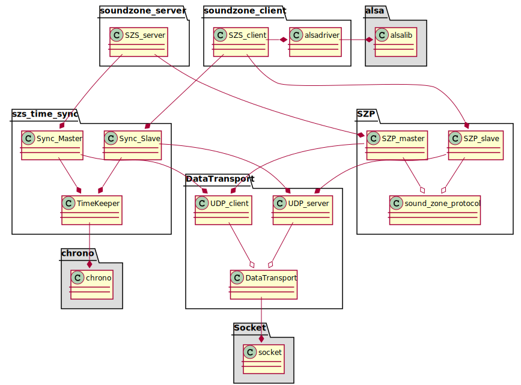
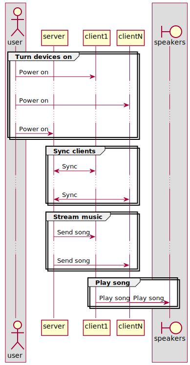

<!-- 
To compile puml use: (Assuming plantuml you are in the directory)
plantuml.jar -tsvg README.md -o diagrams
-->

# Wireless Sound Zones

Wireless sound zone is a multispeaker client-server audio player, where all clients are time synchronized with the server to play audio synced down to xx ms.
Its build for the purpose of making it possible to wirelessly stream the audio required for a sound zone setup, as each speaker needs to play with as little
jitter as possible, and play a different audio track dependent on the filter.


## How does it work

Small little harry potters are inside each raspberry pi, and they swish their wands to make the music go **BOOM!**


## Installation

To install either the server or client, simply clone the repository to the raspberry pi, and run either server_setup.sh or client_setup.sh
It´s important to run the setup files login as root, or else you need to manually unblock the wifi

**To install as client run:**

    sudo su
    git clone https://github.com/NielsDyrberg/Wireless_sound_zones.git
	./Wireless_sound_zones/Client/client_setup.sh
	
**To install as server run:**

    sudo su
    git clone https://github.com/NielsDyrberg/Wireless_sound_zones.git
	./Wireless_sound_zones/Server/server_setup.sh
	
If you do not wish to run the install as root, simply run `sudo rfkill unblock 0` after install. For some reason it cannot run this inside a shell script

## Gathered uml diagram

<!--
```
@startuml class_diagram

together {
    package soundzone_client{
        class SZS_client{}
        class alsadriver{}
    }

    package soundzone_se<!-- 
To compile puml use: (Assuming plantuml you are in the directory)
plantuml.jar -tsvg README.md -o diagrams
-->

# Wireless Sound Zones

Wireless sound zone is a multispeaker client-server audio player, where all clients are time synchronized with the server to play audio synced down to xx ms.
Its build for the purpose of making it possible to wirelessly stream the audio required for a sound zone setup, as each speaker needs to play with as little
jitter as possible, and play a different audio track dependent on the filter.


## How does it work

Small little harry potters are inside each raspberry pi, and they swish their wands to make the music go **BOOM!**


## Installation

To install either the server or client, simply clone the repository to the raspberry pi, and run either server_setup.sh or client_setup.sh
It´s important to run the setup files login as root, or else you need to manually unblock the wifi

**To install as client run:**

    sudo su
    git clone https://github.com/NielsDyrberg/Wireless_sound_zones.git
	./Wireless_sound_zones/Client/client_setup.sh
	
**To install as server run:**

    sudo su
    git clone https://github.com/NielsDyrberg/Wireless_sound_zones.git
	./Wireless_sound_zones/Server/server_setup.sh
	
If you do not wish to run the install as root, simply run `sudo rfkill unblock 0` after install. For some reason it cannot run this inside a shell script

## Gathered uml diagram

<!--
```
@startuml class_diagram

together {
    package soundzone_client{
        class SZS_client{}
        class alsadriver{}
    }

    package soundzone_server {
        class SZS_server{}
    }
}

together {
    package SZP {
        SZP_master --o sound_zone_protocol
        SZP_slave --o sound_zone_protocol
        class sound_zone_protocol {}
    }

    package szs_time_sync {
        class Sync_Slave {}
        class Sync_Master {}
        class TimeKeeper {}
    }

    package DataTransport{
        UDP_server --o DataTransport
        UDP_client --o DataTransport

    }

    package Socket #DDDDDD {
        DataTransport -down-* socket
    }
}

SZS_client --* SZP_slave
SZS_server --* SZP_master
SZS_client --* Sync_Slave
SZS_server --* Sync_Master
SZS_client -right-* alsadriver
SZP_master --* UDP_client
SZP_slave --* UDP_server
Sync_Slave --* TimeKeeper
Sync_Master --* TimeKeeper
Sync_Slave --* UDP_server
Sync_Master --* UDP_client


class UDP_server {}

class UDP_client {}

class DataTransport {}

class socket {}

class SZP_master{}

class SZP_slave{}

@enduml
```
-->




## Sequence diagram over general use

This is an overview of how the product should be used.
The syncronization is not taken into account.

<!--
```
@startuml how_to_use

group Turn devices on
    user -> server: Power on
    user -> client1: Power on
    user -> client2: Power on
    user -> clientN: Power on
end

group Enroll client1
    client1 -> server: Enroll me, i am client1
    client1 <-- server: Thats a'okay
end

group Enroll client2
    client2 -> server: Enroll me, i am client2
    client2 <-- server: Thats a'okay
end

group Enroll clientN
    clientN -> server: Enroll me, i am clientN
    clientN <-- server: Thats a'okay
end

user -> server: Play this song

group Setup music format
    server -> client1: This is the sound format
    server -> client2: This is the sound format
    server -> clientN: This is the sound format
end

group Stream music
    server -> client1: Chunk[1,1] of song
    server -> client2: Chunk[2,1] of song
    server -> clientN: Chunk[N,1] of song

    server -> client1: Chunk[1,2] of song
    server -> client2: Chunk[2,2] of song
    server -> clientN: Chunk[N,2] of song

    server -> client1: Chunk[1,3] of song
    server -> client2: Chunk[2,3] of song
    server -> clientN: Chunk[N,3] of song

    server -> client1: Chunk[1,4] of song
    server -> client2: Chunk[2,4] of song
    server -> clientN: Chunk[N,4] of song
end

@enduml
```
-->

rver {
        class SZS_server{}
    }
}

together {
    package SZP {
        SZP_master --o sound_zone_protocol
        SZP_slave --o sound_zone_protocol

        package sound_zone_protocol {
            class sound_zone_protocol {}
        }
    }

    package szs_time_sync {
        class Sync_Slave {}
        class Sync_Master {}
        class TimeKeeper {}
    }

    package DataTransport{
        UDP_server --o DataTransport
        UDP_client --o DataTransport

    }

    package Socket{
        DataTransport -right-* socket
    }
}

SZS_client --* SZP_slave
SZS_server --* SZP_master
SZS_client --* Sync_Slave
SZS_server --* Sync_Master
SZS_client -right-* alsadriver
SZP_master --* UDP_client
SZP_slave --* UDP_server
Sync_Slave --* TimeKeeper
Sync_Master --* TimeKeeper
Sync_Slave --* UDP_server
Sync_Master --* UDP_client


class UDP_server {}

class UDP_client {}

class DataTransport {}

class socket {}

class SZP_master{}

class SZP_slave{}

@enduml
```
-->


## Sequence diagram over general use

This is an overview of how the product should be used.
The syncronization is not taken into account.

<!--
```
@startuml how_to_use

group Turn devices on
    user -> server: Power on
    user -> client1: Power on
    user -> client2: Power on
    user -> clientN: Power on
end

group Enroll client1
    client1 -> server: Enroll me, i am client1
    client1 <-- server: Thats a'okay
end

group Enroll client2
    client2 -> server: Enroll me, i am client2
    client2 <-- server: Thats a'okay
end

group Enroll clientN
    clientN -> server: Enroll me, i am clientN
    clientN <-- server: Thats a'okay
end

user -> server: Play this song

group Setup music format
    server -> client1: This is the sound format
    server -> client2: This is the sound format
    server -> clientN: This is the sound format
end

group Stream music
    server -> client1: Chunk[1,1] of song
    server -> client2: Chunk[2,1] of song
    server -> clientN: Chunk[N,1] of song

    server -> client1: Chunk[1,2] of song
    server -> client2: Chunk[2,2] of song
    server -> clientN: Chunk[N,2] of song

    server -> client1: Chunk[1,3] of song
    server -> client2: Chunk[2,3] of song
    server -> clientN: Chunk[N,3] of song

    server -> client1: Chunk[1,4] of song
    server -> client2: Chunk[2,4] of song
    server -> clientN: Chunk[N,4] of song
end

@enduml
```
-->

