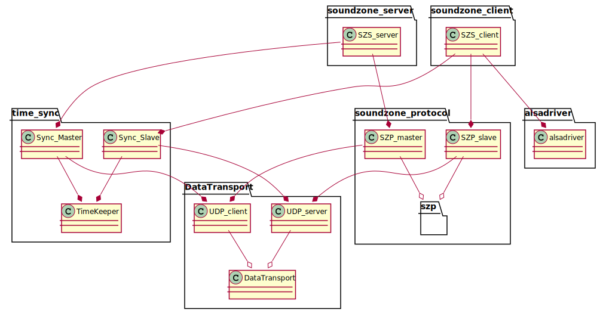

<!-- 
To compile puml use: (Assuming plantuml you are in the directory)
plantuml.jar -tsvg README.md -o diagrams
-->

# Wireless Sound Zones

Wireless sound zone is a multispeaker client-server audio player, where all clients are time synchronized with the server to play audio synced down to xx ms.
Its build for the purpose of making it possible to wirelessly stream the audio required for a sound zone setup, as each speaker needs to play with as little
jitter as possible, and play a different audio track dependent on the filter.


## How does it work

Small little harry potters are inside each raspberry pi, and they swish their wands to make the music go **BOOM!**


## Installation

To install either the server or client, simply clone the repository to the raspberry pi, and run either server_setup.sh or client_setup.sh
It´s important to run the setup files login as root, or else you need to manually unblock the wifi

**To install as client run:**

    sudo su
    git clone https://github.com/NielsDyrberg/Wireless_sound_zones.git
	./Wireless_sound_zones/Client/client_setup.sh
	
**To install as server run:**

    sudo su
    git clone https://github.com/NielsDyrberg/Wireless_sound_zones.git
	./Wireless_sound_zones/Server/server_setup.sh
	
If you do not wish to run the install as root, simply run `sudo rfkill unblock 0` after install. For some reason it cannot run this inside a shell script

## Gathered uml diagram

<!--
```
@startuml class_diagram

together {
    package soundzone_client{
        class SZS_client{}
        class alsadriver{}
    }

    package soundzone_se<!-- 
To compile puml use: (Assuming plantuml you are in the directory)
plantuml.jar -tsvg README.md -o diagrams
-->

# Wireless Sound Zones

Wireless sound zone is a multispeaker client-server audio player, where all clients are time synchronized with the server to play audio synced down to xx ms.
Its build for the purpose of making it possible to wirelessly stream the audio required for a sound zone setup, as each speaker needs to play with as little
jitter as possible, and play a different audio track dependent on the filter.


## How does it work

Small little harry potters are inside each raspberry pi, and they swish their wands to make the music go **BOOM!**


## Installation

To install either the server or client, simply clone the repository to the raspberry pi, and run either server_setup.sh or client_setup.sh
It´s important to run the setup files login as root, or else you need to manually unblock the wifi

**To install as client run:**

    sudo su
    git clone https://github.com/NielsDyrberg/Wireless_sound_zones.git
	./Wireless_sound_zones/Client/client_setup.sh
	
**To install as server run:**

    sudo su
    git clone https://github.com/NielsDyrberg/Wireless_sound_zones.git
	./Wireless_sound_zones/Server/server_setup.sh
	
If you do not wish to run the install as root, simply run `sudo rfkill unblock 0` after install. For some reason it cannot run this inside a shell script

## Gathered uml diagram

<!--
```
@startuml class_diagram

together {
    package soundzone_client{
        class SZS_client{}
    }

    package soundzone_server {
        class SZS_server{}
    }
}

together {
    package alsadriver {
        class alsadriver{}
    }

    package soundzone_protocol {
        class SZP_master{}
        class SZP_slave{}

        package szp {}
    }

    package time_sync {
        class Sync_Slave {}
        class Sync_Master {}
        class TimeKeeper {}
    }

    package DataTransport{
        UDP_server --o DataTransport
        UDP_client --o DataTransport
    }
}

SZP_master --o szp
SZP_slave --o szp

SZS_client --* SZP_slave
SZS_server --* SZP_master
SZS_client --* Sync_Slave
SZS_server --* Sync_Master
SZS_client --* alsadriver
SZP_master --* UDP_client
SZP_slave --* UDP_server
Sync_Slave --* TimeKeeper
Sync_Master --* TimeKeeper
Sync_Slave --* UDP_server
Sync_Master --* UDP_client


class UDP_server {}

class UDP_client {}

class DataTransport {}

@enduml
```
-->




## Use case diagram


## Sequence diagram over general use

This is an overview of how the product should be used.
The syncronization is not taken into account.

<!--
```
@startuml how_to_use
!pragma teoz true

actor user
participant server
participant client1
participant clientN
box
boundary speakers
end box

group Turn devices on
    user -> client1: Power on
    ...
    user -> clientN: Power on
    ...
    user -> server: Power on
end

group Sync clients
    group Sync client
        server -> client1: Sync request
        server <- client1: Sync ack
        server -> client1: Timestamps
        server <- client1: Sync ACP/DEC
    end 
    ...
    group Sync client
        server -> clientN: Sync request
        server <- clientN: Sync ack
        server -> clientN: Timestamps
        server <- clientN: Sync ACP/DEC
    end 

end

group Stream music
    group Send song
        server -> client1: Chunk[1] of song
        ...
        server -> client1: Chunk[end] of song
    end
    ...
    group Send song
        server -> clientN: Chunk[1] of song
        ...
        server -> clientN: Chunk[end] of song
    end
end

group Play song
    client1 -> speakers: Play song
    & clientN -> speakers: Play song
end

@enduml
```
-->


