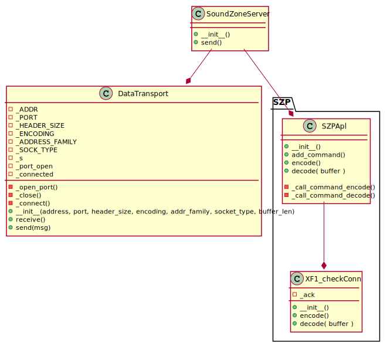

<!-- 
To compile puml use: (Assuming plantuml you are in the directory)
plantuml.jar -tsvg readme.md -o diagrams
-->

# SoundZone Server

version = 0.0.1

**There should be added some more documentation at some point, but i am not sure what.**

## Class diagram

<!--
```
@startuml class_diagram

SoundZoneServer --* DataTransport

package "SZP" {
    SoundZoneServer --* SZPApl
}


class SoundZoneServer {
    + __init__()
    + enroll_client()
    + manual_add_client()
}

class SZPApl {
    + __init__()
    + add_command()
    + encode()
    + decode( buffer )

    - _call_command_encode()
    - _call_command_decode()
}

class DataTransport {
    - _ADDR
    - _PORT
    - _HEADER_SIZE
    - _ENCODING
    - _ADDRESS_FAMILY
    - _SOCK_TYPE
    - _s
    - _port_open
    - _connected

    - _open_port()
    - _close()
    - _connect()
    + __init__(hostname, port, header_size, encoding, addr_family, socket_type, buffer_len)
    + receive()
    + send(msg)

}

@enduml
```
-->

