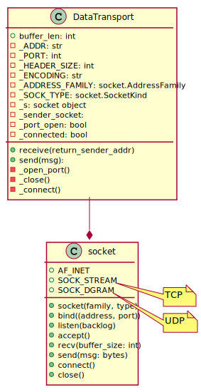

<!-- 
To compile puml use: (Assuming plantuml you are in the directory)
plantuml.jar -tsvg readme.md -o diagrams
-->

A python module mainly building on sockets. 
It is used to transport data between a server and clients, 
for the SoundZone Protocol.
In the layer topology this module is between layer 7 (SZP) and layer 4


## Class diagram

<!--
```
@startuml class_diagram

DataTransport --* socket

class DataTransport {
    + buffer_len: int
    - _ADDR: str
    - _PORT: int
    - _HEADER_SIZE: int
    - _ENCODING: str
    - _ADDRESS_FAMILY: socket.AddressFamily
    - _SOCK_TYPE: socket.SocketKind
    - _s: socket object
    - _sender_socket:
    - _port_open: bool
    - _connected: bool

    + receive(return_sender_addr)
    + send(msg):
    - _open_port()
    - _close()
    - _connect()
}

class socket {
    + AF_INET
    + SOCK_STREAM
    + SOCK_DGRAM

    + socket(family, type)
    + bind((address, port))
    + listen(backlog)
    + accept()
    + recv(buffer_size: int)
    + send(msg: bytes)
    + connect()
    + close()
}

@enduml
```
-->


