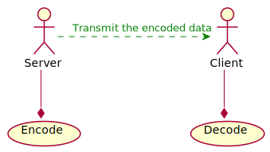
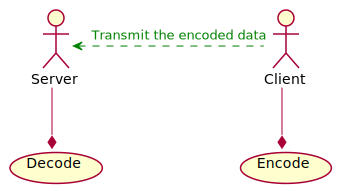
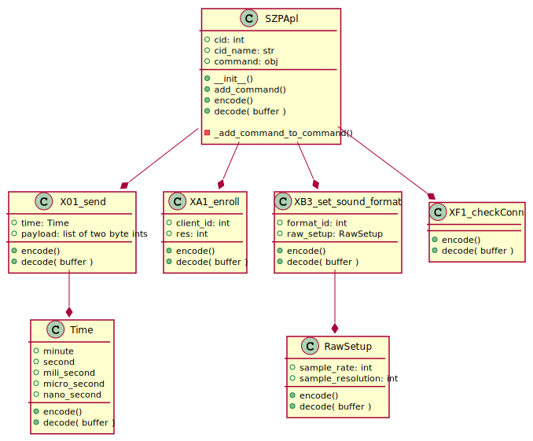

<!-- 
To compile puml use: (Assuming plantuml you are in the directory)
plantuml.jar -tsvg readme.md -o diagrams
-->

# Documentation for the implementation of SoundZone Protocol

This package implements the SoundZone protocol.

( Using SZP version = 0.0.2 )


The module should be used to encode an decode hex strings for the 7th layer protocol SoundZone Protocol

## Use cases

Under this section the two use cases will be described.

<!--
@startuml use_cases_1

:Server:
:Client:

(Encode)
(Decode)

Server --* Encode
Client --* Decode
Server -> Client #green;line.dashed;text:green : Transmit the encoded data

@enduml
-->


<!--
@startuml use_cases_2

:Server:
:Client:

(Encode)
(Decode)

Server --* Decode
Client --* Encode
Server <- Client #green;line.dashed;text:green : Transmit the encoded data

@enduml
-->


## How to use

This section will give a few examples on how to use the class.

### Encode

```Python
szp = SZPApl()  # Create an object of SZPApl
szp.add_command(command="send")  # Define the command to use
# The chunk of lines are filling the command data
szp.command.payload = [0x4255, 0x5136, 0x1234, 0x5678, 0x1111]
szp.command.time.minute = 0x01
szp.command.time.second = 0x42
szp.command.time.mili_second = 0x24
szp.command.time.micro_second = 0x0324
szp.command.time.nano_second = 0x0244

encoded_hex = szp.encode()  # Encode the object
```

### Decode

```Python
msg_rcv = '01014200240324024442555136123456781111' # The hex string that would come out of the encoding abobe

szp = SZPApl()  # Create an object of SZPApl
szp.decode(msg_rcv)  # Decode the hex string. If succesfull the object will afterwurds contain all the object field filled out.
```

## Class diagram

<!--
```
@startuml class_diagram

SZPApl --* X01_send
SZPApl --* XA1_enroll
SZPApl --* XB3_set_sound_format
SZPApl --* XF1_checkConn

X01_send --* Time
XB3_set_sound_format --* RawSetup

class SZPApl {
    + cid: int
    + cid_name: str
    + command: obj

    + __init__()
    + add_command()
    + encode()
    + decode( buffer )

    - _add_command_to_command()
}

class X01_send {
    + time: Time
    + payload: list of two byte ints

    + encode()
    + decode( buffer )
}

class XA1_enroll {
    + client_id: int
    + res: int

    + encode()
    + decode( buffer )
}

class XB3_set_sound_format {
    + format_id: int
    + raw_setup: RawSetup

    + encode()
    + decode( buffer )
}

class XF1_checkConn {


    + encode()
    + decode( buffer )
}

class Time {
    + minute
    + second
    + mili_second
    + micro_second
    + nano_second

    + encode()
    + decode( buffer )
}

class RawSetup {
    + sample_rate: int
    + sample_resolution: int

    + encode()
    + decode( buffer )
}

@enduml
```
-->



