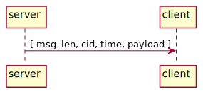
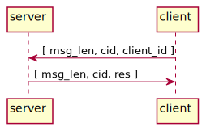
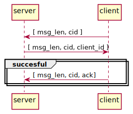
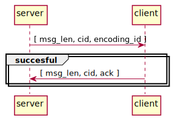
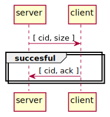
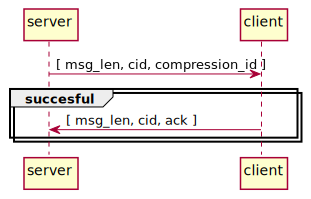
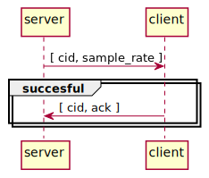
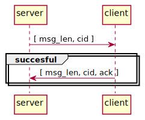

# Documentation for SoundZone Protocol
<!-- 
To compile puml use: (Assuming plantuml you are in the directory)
plantuml.jar -tsvg readme.md -o sequence_diagrams
-->

version = 0.0.2

This file will document SZP.

As it is a 7th layer protocol, it is treated as a Point-Point communication

| Defines | Values |
|---|---|
| IPv | IPv4 |
| Transport protocol | UDP |
| Port | 1695 ( Seemingly not used ) |
| Transmission encoding | utf-8 |

## Main Structure

[msg_len, CID, {payload} ]

* msg_len - Length of message
* CID - Command Id
* payload - Data to send (Structure depends on the CID)

## Commands 

### Command groups

| Range | Name |
|---| ---|
| 0x00 - 0x10 | Normal use |
| 0xA0 - 0xC0 | Configuration |
| 0xF0 - 0xFF | Debugging |

### Command list

|CID | Name | Description |
|---|---|---|
| 0x01 | send | Send a payload to a client |
|||
| 0xA1 | enroll_c | Used by client to enroll |
| 0xA2 | enroll_s | Used by client to enroll |
| 0xB1 | set_time_encode | Sets the encoding of the time |
| 0xB2 | set_size_msg_len | Sets size of msg_len |
| 0xB3 | set_sound_compression | Sets the compression for the music |
| 0xB4 | set_sample_rate | Sets the sample rate of the music |
|||
| 0xF1 | checkCon | Used to check connection, used for debug |

---

### 01 - send

To use this command, client has been preconfigured with a Id.
So the rigth filters is used for the right Id.

| Tag | Size [bytes] | Value | Description | 
|---|---|---|---|
| msg_len | Depends on encoding | - | Length of message |
| cid | 1 | 0x01 | Command Id |
| time | Depends on encoding | - | Time to play the block of sound |
| payload | 1 | - | Payload |

<!--
```
@startuml 01_send
server -> client: [ msg_len, cid, time, payload ]
@enduml
```
-->




---

### A1 - enroll_c - client assigned id's
To use this command, client has been preconfigured with a Id.
So the rigth filters is used for the right Id.

| Tag | Size [bytes] | Value | Description | 
|---|---|---|---|
| msg_len | Depends on encoding | - | Length of message |
| cid | 1 | 0xA1 | Command Id |
|  client_id | 1 | 0x01-0xFF | Assigned client id (0 is reserved for server) |
| res | 1 | 0 \| 1 | denie \| accept |

<!--
```
@startuml A1_enrole_c
server <- client: [ msg_len, cid, client_id ]
server -> client: [ msg_len, cid, res ]
@enduml
```
-->



---

### A2 - enroll_s - server assigned id's
To use this command, it has to be figured out afterwurds which client needs what filter.

| Tag | Size [bytes] | Value | Description | 
|---|---|---|---|
| msg_len | Depends on encoding | - | Length of message |
| cid | 1 | 0xA2 | Command Id |
| client_id | 1 | 0x01-0xFF | Assigned client id |
| ack | 1 | 0x01 | Accepted |

<!--
```
@startuml A2_enrole_s
server <- client: [ msg_len, cid ]
server -> client: [ msg_len, cid, client_id ]
group succesful
    server <- client: [ msg_len, cid, ack]
end
@enduml
```
-->



---

### B1 - set_time_encode
Defines what encoding the clock uses.

| Tag | Size [bytes] | Value | Description | 
|---|---|---|---|
| msg_len | Depends on encoding | - | Length of message |
| cid | 1 | 0xB1 | Command Id |
| encoding_id | 1 | 0x01-0xFF | Encoding Id |
| ack | 1 | 0x01 | Acknolegment |

<!--
```
@startuml B1_set_time_encode
server -> client: [ msg_len, cid, encoding_id ]
group succesful
    server <- client: [ msg_len, cid, ack ]
end
@enduml
```
-->



**Supported** **time** **encodings**
| Id | Name |
|--- |--- |
| 0x01 | hh:mm:ss:ms |
| 0x02 | mm:ss:ms:µs |
| 0x03 | mm:ss:ms:µs:ns |

---

### B2 - set_size_msg_len
Sets the size of the msg_len.
With a size of 2 bytes, the payload can maximum be 65.535 bytes long.
The change of msg_len first takes place AFTER the client has ackoleged 

| Tag | Size [bytes] | Value | Description | 
|---|---|---|---|
| msg_len | Depends on encoding | - | Length of message |
| cid | 1 | 0xB2 | Command Id |
| size | 1 | 0x01-0xFF | Size of msg_len |
| ack | 1 | 0x01 | Acknolegment |

<!--
```
@startuml B2_set_time_encode
server -> client: [ msg_len, cid, size ]
group succesful
    server <- client: [ msg_len, cid, ack ]
end
@enduml
```
-->



---

### B3 - set_sound_compression
Sets the size of the payload_len.
With a size of 2 bytes, the payload can maximum be 65.535 bytes long.

| Tag | Size [bytes] | Value | Description | 
|---|---|---|---|
| msg_len | Depends on encoding | - | Length of message |
| cid | 1 | 0xB3 | Command Id |
| compression_id | 1 | 0x01-0xFF | Payload compression type |
| ack | 1 | 0x01 | Acknolegment |

<!--
```
@startuml B3_set_sound_compression
server -> client: [ msg_len, cid, compression_id ]
group succesful
    server <- client: [ msg_len, cid, ack ]
end
@enduml
```
-->



**Supported** **compressions**
| Id | Name |
|--- |--- |
| 0x01 | Uncompressed |

---

### B4 - set_sample_rate
Sets the sample rate of the music

| Tag | Size [bytes] | Value | Description | 
|---|---|---|---|
| msg_len | Depends on encoding | - | Length of message |
| cid | 1 | 0xB4 | Command Id |
| sample_rate | 2 | - | Sample rate |
| ack | 1 | 0x01 | Acknolegment |

Supported sample rates: **1200**, **42000** [Hz] 

<!--
```
@startuml B4_set_sound_compression
server -> client: [ msg_len, cid, sample_rate ]
group succesful
    server <- client: [ msg_len, cid, ack ]
end
@enduml
```
-->



---

### F1 - checkCon

| Tag | Size [bytes] | Description | 
|---|---|---|
| msg_len | Depends on encoding | - | Length of message |
| cid | 1 | Command Id | 

<!--
```
@startuml F1_check_con
server -> client: [ msg_len, cid ]
group succesful
    server <- client: [ msg_len, cid ]
end
@enduml
```
-->

