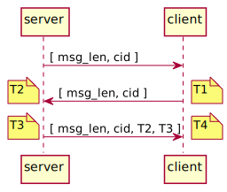
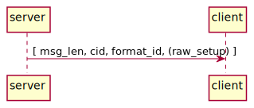

# Documentation for SoundZone Protocol
<!-- 
To compile puml use: (Assuming plantuml you are in the directory)
plantuml.jar -tsvg readme.md -o sequence_diagrams
-->

version = 0.0.2

This file will document SZP.

As it is a 7th layer protocol, it is treated as a Point-Point communication

| Defines | Values |
|---|---|
| IPv | IPv4 |
| Transport protocol | UDP |
| Port | 1695 ( Seemingly not used ) |
| Size of msg_len | 2 bytes |
| Endianess | Big-endian |

## Main Structure

[msg_len, CID, {payload} ]

* msg_len - Length of message
* CID - Command Id
* payload - Data to send (Structure depends on the CID)

## Commands 

### Command groups

| Range | Name |
|---| ---|
| 0x00 - 0x10 | Normal use |
| 0xA0 - 0xC0 | Configuration |
| 0xF0 - 0xFF | Debugging |

### Command list

|CID | Name | Description |
|---|---|---|
| 0x01 | [send](#01---send) | Send a payload to a client |
|||
| 0xA1 | [enroll](#a1---enroll) | Used by client to enroll |
| 0xB1 | reset_time | Used by master to reset time |
| 0xB2 | sync_time | Used to syncronize master and slave clocks |
| 0xB3 | [set_sound_format](#b3---setsoundformat) | Sets the format of the music |
|||
| 0xF1 | [checkCon](#f1---checkcon) | Used to check connection, used for debug |

---
---

## 01 - send
This command is used to send sound data to the client.

| Tag | Size [bytes] | Value | Description | 
|---|---|---|---|
| msg_len | 2 | - | Length of message |
| cid | 1 | 0x01 | Command Id |
| time | 7 | - | Time to play the block of sound |
| payload | - | - | Payload |

<!--
```
@startuml 01_send
server -> client: [ msg_len, cid, time, payload ]
@enduml
```
-->


### Time Encoding
[ mm, ss, ms, µs, ns ]
| Byte| Range | Description | Symbol |
|---|---|---|---|
| 1 | [0-23] | Hour | hh |
| 2 | [ 0-60 ] | Minute | mm |
| 3 | [ 0-60 ] | Second | ss |
| 4-5 | [ 0-1000 ] | Mili second | ms |
| 6-7 | [ 0-1000 ] | Micro second | µs |

---

## A1 - enroll
To use this command, client has been preconfigured with an Id.
So the rigth filter is used for the right Id.

In order for the client to be configured with an Id, it has to be planned where each client is located in the room, the master should then have the plan so it knows where wich id is located.
A client is then configured according to where it is located. And then uses this Id to enroll.


| Tag | Size [bytes] | Value | Description | 
|---|---|---|---|
| msg_len | 2 | - | Length of message |
| cid | 1 | 0xA1 | Command Id |
|  client_id | 1 | 0x01-0xFF | Assigned client id (0 is reserved for server) |
| res | 1 | 0 \| 1 | denie \| accept |

<!--
```
@startuml A1_enrole_c
server <- client: [ msg_len, cid, client_id ]
server -> client: [ msg_len, cid, res ]
@enduml
```
-->


---

## 0xB1 - reset_time
Used by master to reset time


---

## 0xB2 - sync_time
Used to syncronize master and slave clocks |

| Tag | Size [bytes] | Value | Description | 
|---|---|---|---|
| msg_len | 2 | - | Length of message |
| cid | 1 | 0xA1 | Command Id |
|  T2 | 1 | - | Timestamp at the server, when recieving |
|  T3 | 1 | - | Timestamp at the server, when transmitting |

<!--
```
@startuml B2_sync_time
server -> client: [ msg_len, cid ]
server <- client: [ msg_len, cid ]
note right: T1
note left: T2
server -> client: [ msg_len, cid, T2, T3 ]
note left: T3
note right: T4
@enduml
```
-->



---

## B3 - set_sound_format
Sets sound format.

| Tag | Size [bytes] | Value | Description | 
|---|---|---|---|
| msg_len | 2 | - | Length of message |
| cid | 1 | 0xB3 | Command Id |
| format_id | 1 | 0x01-0x04 | Payload format type. Supported types can be found under [supported formats](#supported-formats) |
| raw_setup | 3 | - | (Only used if format_id == 0x01) Bytes describing how to handle the Raw file. Described in [raw_setup](#rawsetup) |

<!--
```
@startuml B3_set_sound_format
server -> client: [ msg_len, cid, format_id, (raw_setup) ]
@enduml
```
-->



### Supported formats
| Id | Name | Notes |
|--- |--- |---|
| 0x01 | Raw | Raw only supports Mono |
| 0x02 | WAV ||
| 0x03 | FLAC||
| 0x04 | PCM ||

### raw_setup 

[ sample_rate, sample_resolution ]

| Name | Size [Bytes] | Value | Description | Notes |
| ---|---|--- |---|---|
| sample_rate | 2 | 1200 Hz | Sample rate | Other rates should eventually be supported |
| sample_resolution | 1 | 16 bits | Number of bits per sample | Eventually other resolutions could be supported |

---

## F1 - checkCon
Used the ckeck Connection on SZP level

| Tag | Size [bytes] | Value | Description | 
|---|---|---|---|
| msg_len | 2 | - | Length of message |
| cid | 1 | 0xF1 | Command Id |
| ack | 1 | 0x01 | Acknolegment | 

<!--
```
@startuml F1_check_con
server -> client: [ msg_len, cid ]
group succesful
    server <- client: [ msg_len, cid, ack ]
end
@enduml
```
-->


